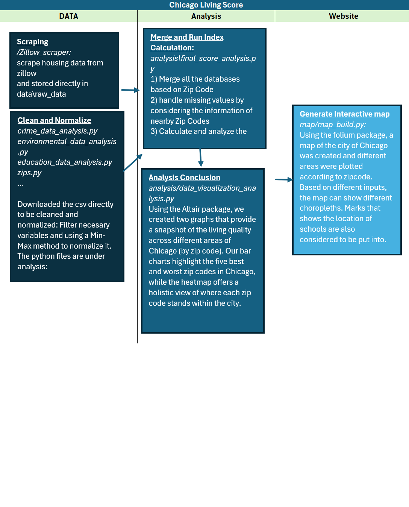

### Project Structure

```bash
ChicagoLivingScore/
├── .venv/
├── analysis/
│   └── all_data_normalize.py
│   └── final_score_analysis.py
│   └── data_visualization_analysis.py
│   └── education_data_analysis.py
│   └── crime_data_analysis.py
│   └── ....(other index analysis file)
├── data/
│   ├── cleaned_data/
│   │   └── cleaned_data_crime.csv
│   │   └── cleaned_data_economic_infrastructure.csv
│   │   └── cleaned_data_education.csv
│   │   └── cleaned_data_environment.csv
│   │   └── cleaned_data_housing.csv
│   │   └── final_living_score.csv
│   └── raw_data/
│       └── raw_data_econ_infra.csv
│       └── raw_data_housing.csv
│       └── ....(other raw index datasets)
├── map/
│   ├── mapbuild.py
├── scraper/
│   ├── scraper_data/
│   │   └── zillow.py
│   │   └── run.py
├── website/
│   ├── static/
│   ├── templates/
│   └── app.py
├── pyproject.toml
├── uv.lock
├── README.md
└── ...
```

#### Project Stucture Details
This project is structured in the following section
- Data(\data)
    - raw_data:
      
        original datasets downloaded from Chicago Data Portal
        scraped datasets from Zillow
    - cleaned_data:
      
        normalized datasets after cleaning, analyzing

- Scraper(\scraper)
    - results:
      
        extracted datasets from Zillow
    - function:
      
        main scraper function(\zillow.py)
      
        change url for scraping (\run.py)

- Map and Spatial Analysis(\map)
    - main function (\mapbuilder.py) 

- Interactive Website(\website)
    - main function (\app.py)
    - fronend file:
      
        templates(\base.html; \about.html; \service.html; \analyis.html; github.html\)
      
        static(style.css)

### Project Workflow


### Data Sources
**1. Scraped Dataset: Housing Data from Zillow**
**How to Use?**

Step 1:

Register on https://scrapfly.io/login to get the API key
```bash
$ export SCRAPFLY_KEY="YOUR SCRAPFLY KEY"
```
Step 2:
```bash
$ git clone https://github.com/scrapfly/scrapfly-scrapers.git
$ cd ChicagoLivingScore/scraper
$ poetry install
```
Step 3:
Open the **run.py**, customize 2 urls:

1) First url: 
   Open the main interface of Zillow, after entering the the city or zip code or address you want to search, you will be led to a main interface with map and property listing, use the url of this page as our first url
2) Seconf url:
   On the same page, randomly click one of the house listings, then you will be led to a page listed the detailed properties of this listing, use the url of the new page as your second url

After changing these 2 urls, please enter:
```bash
$ poetry run python run.py
```
Step 4:
You can check the extracted results stored in the **results** file.

Overall we utilized the API supported by Scrapefly, and we rewrote the code using the skills during this quarter. In order to avoid influence on Zillow, we limit 1 page of scraping per time, once you can scrape around 80-100 house listing information. If you want to get more data, please change the urls every time you run, and the free limiation of one account is 1000.

**Please see more deatails in the zillow.py by checking the comments**


**2. Scraped Dataset: Map Data**


**3. Index Dataset**

1) Infrastructure and Econ Dataset

2) Environment Dataset

3) Crime Dataset

4) Education Dataset

5) Housing Price Dataset (scraped)

**Scraped Dataset: Economic and infrastructure indicators from US Census Bureau**

Run **economic_infrastructure_analysis.py**, to get the socres for ecnonmic and infrastructure score for each zip code in Chicago.

This is done through several functions that are linked together to get the data:

a.  load_data(file_path):
    This function loads the data and also cleans the strings.
    
b.  normalize(df):
    This function takes a dataframe and helps normalize data for it to be compared between variables and zip codes.
    
c.  nornamlize_data(file_path)
    Uses the above mentioned helper functions and brings everything together. This function outputs a csv file 
    with all the cleaned and normalized data and saves it as cleaned_data_infrastructure.csv which is then used for our analysis
        
d.  The main function, runs all of the previous function when the pycode
    is run and the csv file is created.
    
#Regarding the indicators:
Our cleaned file has 6 indicators that provides a holistic view about the economic condition along with 
walability and mean travel times to work for each zip code in Chicago. 

**Scraped Dataset: Chicago Data for Crimes and Environment**
*How to Use?*
Step 1:

Download the last zip code file with the shapefile of each zip code:
"https://catalog.data.gov/dataset/tiger-line-shapefile-2022-nation-u-s-2020-census-5-digit-zip-code-tabulation-area-zcta5"

Step 2:
Open the *zips.py*, and run it:
a. load_shapefile_with_cache(shp_path): 
This will create a cache geodatainformation of the zips, that will allows us
to match the locations of the crimes and environmental hazards to specific zip codes

Step 3:
Run **environmental_data_analysis.py**, and **crime_data_analysis.py** to get the data for each zip code. In each
of these files there are three functions:
a. load_frs_csv():This function loads the csv file of the crimes or environmental hazards
and afterwards convert them to points objects.

    ***In regards to crime information, we used only the data for crimes that 
    ended in arrest and non domestic. This will help us focus the more severe 
    crimes that people are more worried about.
    
b. find_zip_codes(gdf_zip, points):
    This function matches the points to the respetive zip code using both files obtained
    And give us a list of points with their respective zip codes and also saves it
    as a csv file.
    
c. def info():
    Finally this function takes the csv file generated and adds the number of crimes
    and environmental hazards per zip code.

**Scraped Dataset: Chicago Data for Schools**

Run **education_data_analysis.py**, to get the education score for each zip code. This is done
through several functions that are linked together to get the data:

a. load_data(file_path):
    This function loads the data and also cleans the strings.
    
b.standardize_column(series):
    This function takes a series and helps standarize to compare between variables
    and zip codes.
    
c. map_categorical_values(df)
    This function maps the categorical values and maps them to an index between
    0 and 4.
    
d. compute_zip_level_metrics(df):
    This function aplies the stantarization to the variables we want to analize
    in the columns and obtains a score for each of the variables for each zip code.
    
e. The main function, runs all of the previous function when the pycode
    is run and the csv file is created.
    
f. Finally because some of the zip codes do not have any public school, we calculate the value of the average of the two nearest zip codes 
and input it to them(For example if 60615 was missing then it would take the average of 60614 and 60616 given that there was data available).
    
#Regarding the school information:
    we took the sat scores for and approach to measure the academic score of 
    schools.
    For the non academic score, it was an average of several variable regarding
    other school characteristic such as:
    
        categories = [
        "creative_school_certification",
        "school_survey_involved_families",
        "school_survey_effective_leaders",
        "culture_climate_rating"
    ]

#### Analysis

Our analysis section features two graphs that provide a comprehensive overview of living conditions across various zip codes in Chicago. 
The analysis addresses our primary question: **Where are the top best and worst places to live in Chicago?**

In addition to these graphs, we have included a heatmap that offers a snapshot of where each zip code stands based on its final score, 
calculated from our selected metrics. Each graph is accompanied by a brief written analysis to further explain its insights.

To view the bar chart ranking the top five best and worst places to live, enter "top 5" in the search bar under the analysis page.
Similarly, you can access the heatmap by entering "relationship" in the search bar.

### Team Responsibilities
**Lydia Liu**
1. Establish index scoring and calculation methodologies (group collaboration)
   
2. Scrape the housing dataset from Zillow.
   
3. Clean, normalize, and analyze the housing data.
   
4. Implement a standardized normalization procedure.
   
5. Build the website.

6. Wrote milstones update and final report.

**Yuri Chang**
1. Scrape and Establish Geodata of the city of Chicago.

2. Help scrape the housing dataset from Zillow.

3. Help clean and modify the data.

4. Draw the maps.

**Hamza Tariq**
1. Establish index matric and calculation methodolgies (group collaboration)

2. Helped scrape housing dataset from zillow
   
3. Collect economic and infrastructure dataset

4. Clean, normalize and analyze economic and infrastructure data

5. Conducted analysis of the overall data sets

6. Developed data visualization graphs

**Alejandro Armas**


    
    


